## Roadmap

* 30 mins - Introduction to ClassifyR and description of workshop data

* 50 mins - Interactive session using ClassifyR

* 10 mins - Wrap up and reflection

---

class: segue-red

# Part 1: Software Design and Features

---

## Motivation for Development

* A standardised form of cross-validation is not provided by a standard R installation. Often, researchers code their own cross-validation loop for each project, allowing opportunities for implementation inconsistencies to occur.

--

* A few frameworks have been developed (e.g. `MCRestimate`, `MLInterfaces`, `caret`) but their focus is on classification, so evaluation of the features and predictions is not comprehensive.

--

* Input formats of existing classification frameworks don’t seamlessly handle new data containers for omics data sets, such as `MultiAssayExperiment`.

--

* ClassifyR provides a standardised cross-validation framework with a focus on biologically motivated performance evaluation and seamlessly operates on `DataFrame` and `MultiAssayExperiment` S4 containers across mulitple cores using `BiocParallel` functionality.

---

## Varieties of Data

Three kinds of data sets can be used as input.

.center[
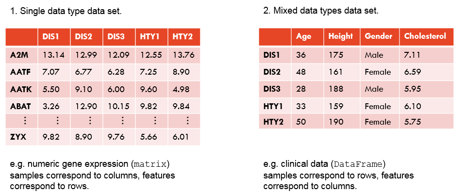
]

---

.center[
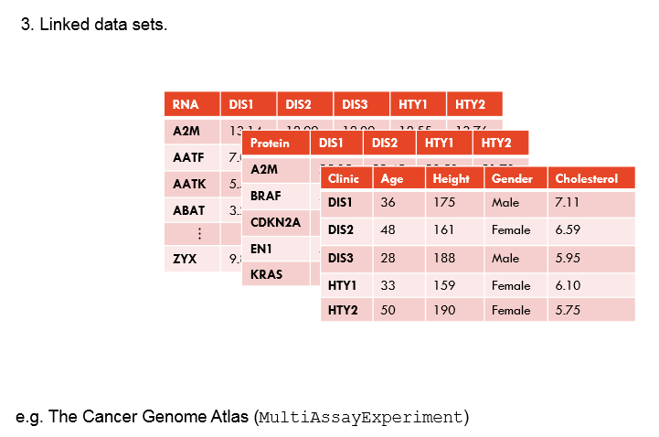
]

---

## DataFrame Container

`ClassifyR` sends the data set (or subsets of it) to feature selection and classification functions as a `DataFrame`. Either the input data is a `DataFrame` or is converted into one without loss of information.

.center[
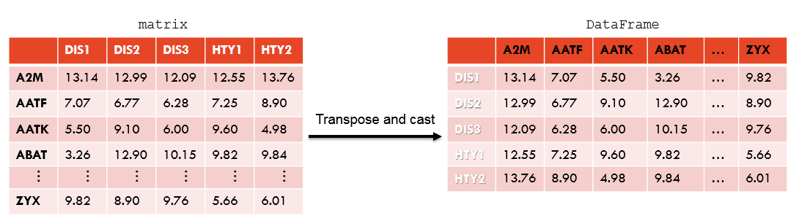
]

---

## DataFrame Container

.center[
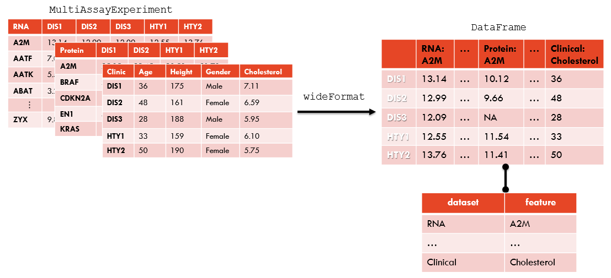
]


---
## Cross-validation Overview

* Cross-validation is the procedure of selecting features and training a classifier on a set of samples and making predictions on a distinct set of samples.

--

* The function runTests manages cross-validation. `runTests` repeatedly calls `runTest` to perform a single iteration of training and testing.

--

* `runTest` may be used directly for a single training set and a single test set, an experimental design which some published studies have.

--

* There are many cross-validation designs commonly used in practice. `runTests` accepts a variety of customisations for the schemes.

---
## Cross-validation: Repeated Permute and *k*-Fold

The order of samples is repeatedly permuted and they are divided into *k* approximately equally-sized groups. Each group is used as the test set once. When complete, each sample is predicted as many times as the number of repetitions of sample permutation.

.center[
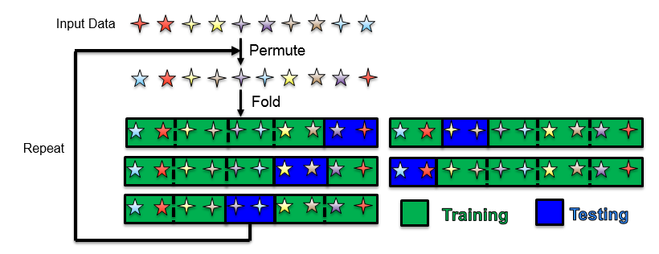
]

This is the default scheme of `runTests`. By default, 100 permutations are each partitioned into five folds.

---
## Cross-validation: Repeated Permute and Split

The order of samples is repeatedly permuted and they are divided into two groups. Only one group is used as the test set (default: 25% of samples). When complete, each sample is predicted approximately as many times as the number of repetitions $\times$ test set percentage.

.center[
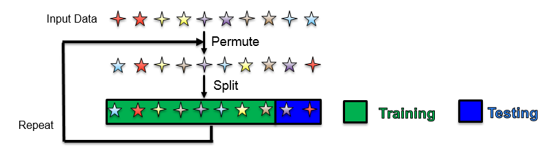
]

---
## Cross-validation: Leave-`k`-Out

All possible combinations of *k* samples are chosen from all *n* samples to form the test set. Default value of *k* is 2.

.center[
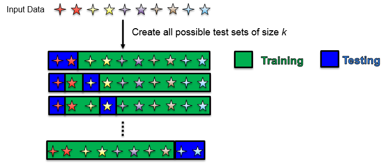
]

For a moderately sized data set, any value of *k* > 3 will not complete in a reasonable amount of time.

---
## Cross-validation: Leave-`k`-Out

For *k* = 1, each sample is predicted once.

For *k* = 2, each sample is predicted $n-1$ times.

For *k* = 3, each sample is predicted $(n-1) \times (n-2) / 2$ times.

---
## Cross-validation: Ordinary k-fold

The samples are divided into *k* approximately equally-sized groups. Each group is used as the test set once. Default *k* is 5.

.center[
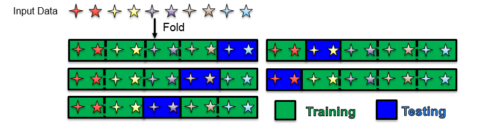
]

Because each sample is predicted once, there's no estimate of class prediction variability.

---
## Types of Change

A change between classes of mean, variability or distribution may be informative for predicting classes.

.center[
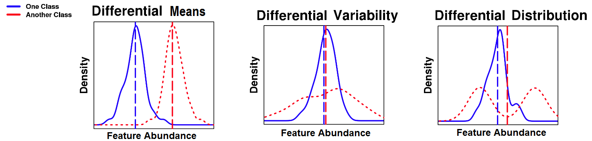
]


---
## Functions for Feature Selection

There are numerous functions provided for popular feature selection approaches. Feature selection by the included functions is typically based on a ranking of features, followed by choosing the top *p* features which give the best resubstitution error rate.

.center[
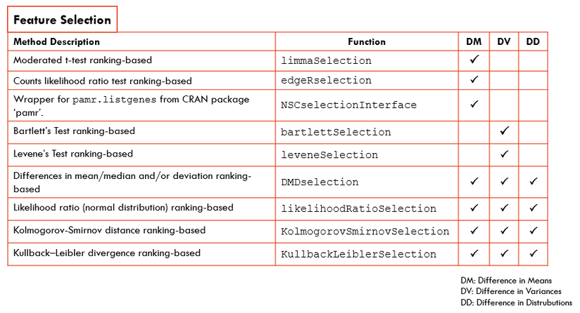
]

---
## Wrappers for Classification

There are a variety of functions implementing or wrapping popular classifiers.

.center[
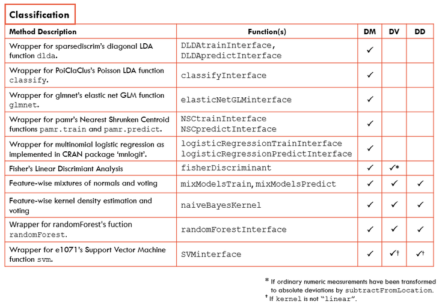
]

---
## Functions for Network-based Classification

Biological features don't work in isolation but are a part of large networks. Some common network-based classification algorithms are included with `ClassifyR`.

.center[
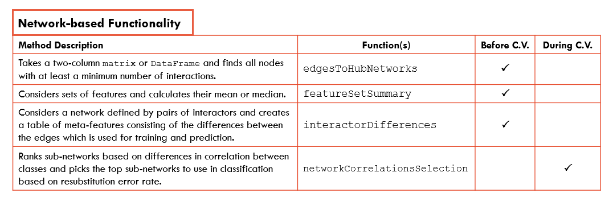
]

---

## Parameter Container Classes

A list of instances of parameter classes is provided to `runTests` to be applied to each iteration of cross validation. They specify the kind of data transformation, feature selection and classification to do.

1. `TransformParams` (optional): The first parameter is a function which transforms the values somehow. For example, `transParams <- TransformParams(subtractFromLocation)`.
--
<br>
2. `SelectParams` (optional): The first parameter is a function which returns a subset of feature names. For example, `selParams <- SelectParams(tTestSelection)`.
--
<br>
3. `TrainParams` : The first parameter is a function which takes as input a `DataFrame` and either a factor vector of classes or a `DataFrame` column name containing them and trains a classifier. It might also do the predictions on the test set and accept the test set in the third parameter position.<br>For example, `trainParams <- TrainParams(naiveBayesKernel)`.
--
<br>
4. `PredictParams` : The first parameter is either a function which takes as input a trained model followed by the test set `DataFrame` and predicts classes and/or class scores or `NULL` if the training function also makes predictions. For example, `predParams <- PredictParams(NULL)`.

---
## Classification Performance Evaluation

* Feature selection stability evaluates whether the selected features are consistent between iterations of cross validation.

* Many of the typical classification metrics may be calculated. Examples are accuracy, error rate, ROC plot. Most are applicable for any number of classes greater than two.

* **Sample-wise** accuracy and error-rate calculation allows the identification of samples which are consistently misclassified within a classification or across different classifications.

---
class: segue-red

# Part 2: Application to Prognosis of Melanoma Patients

---

## Data Set Introduction

* 32 metastatic melanoma patients had their cancer analysed by SWATH mass spectrometry.

* 18 patients were categorised as *good* prognosis (survived more than four years) and 14 patients were categorised as *poor* prognosis (died less than two years).

.center[

]

* Protein abundance data is originally Supplementary Table S5b. [Link to paper.](https://www.nature.com/articles/s41416-018-0227-2)

---

## Formatted data

* RData file available in the [Github Repository](https://github.com/SydneyBioX/TrainClassifyR) in 'data' folder, [direct link to RData here](https://github.com/SydneyBioX/TrainClassifyR/blob/master/data/melanomaSWATH.RData).

--

```{r}
suppressMessages(library(ClassifyR))
load("data/melanomaSWATH.RData")
ls()
table(classes)
dim(measurements)
```

---

## External biological information

* Hallmarks gene sets: Broad Institute MSigDB version 6.2.

* BioPlex interactor pairs: BioPlex 2.0 Architecture of the Human Interactome Defines Protein Communities and Disease Networks. Nature 545:505-509.

Both files are available in the [Github Repository](https://github.com/SydneyBioX/TrainClassifyR) in 'databases' folder.

---

## Task

The aim is to build classification models to predict *prognosis*, and to estimate the error rate using cross-validation.

The classification model types include:

--

* Differential means 

--

* Differential variability 

--

* Differential distribution

--

* Differential network

--

Compare the cross-validation error rates between these methods.

Follow the [Activity document]() available online for this Part.

---

## Differential means

```{r, fig.height = 6}
plotFeatureClasses(measurements, classes, "PMEL_HUMAN", dotBinWidth = 0.2)
```

---

```{r, fig.height = 6}
plotFeatureClasses(measurements, classes, "ITAV_HUMAN", dotBinWidth = 0.2)
```

---

```{r, fig.height = 6}
plotFeatureClasses(measurements, classes, "ICAM1_HUMAN", dotBinWidth = 0.2)
```


---

## Differential variability 

Information.

---

## Differential distribution

Information.

---

## Differential network

Information.

---

## Topic

Information.

---
class: segue-red

# Part 3: Getting Help with Usage

---

## Vignettes

* A fully worked example on a recent asthma classification data set (*Scientific Reports*, 2018) using a couple of different classifiers and a variety of performance metrics is provided.

* A demonstration of how to create a wrapper function for the *k* Nearest Neighbours function.

```{r, eval = FALSE}
browseVignettes("ClassifyR")
```

.center[
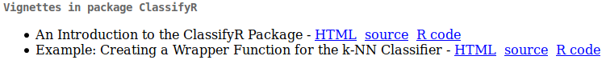
]

---

## Support Forum

A good way to ask questions and receive answers that may be useful to others.

.center[
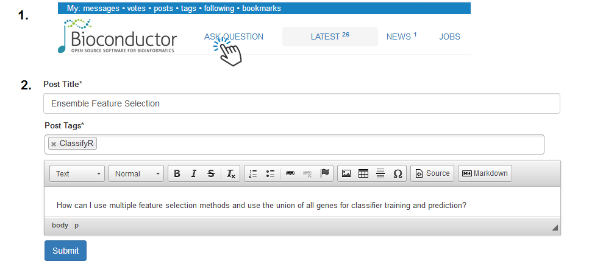
]

.center[Visit <a href="http://support.bioconductor.org" target="_blank">http://support.bioconductor.org</a>]

---

# Acknowledgements

Funding, research team.

---

# References

* Dario Strbenac, Graham J. Mann, John T. Ormerod, Jean Y.H. Yang; ClassifyR: an R package for performance assessment of classification with applications to transcriptomics, Bioinformatics, Volume 31, Issue 11, 1 June 2015, Pages 1851–1853, https://doi.org/10.1093/bioinformatics/btv066

* [ClassifyR on Bioconductor](https://bioconductor.org/packages/release/bioc/html/ClassifyR.html)