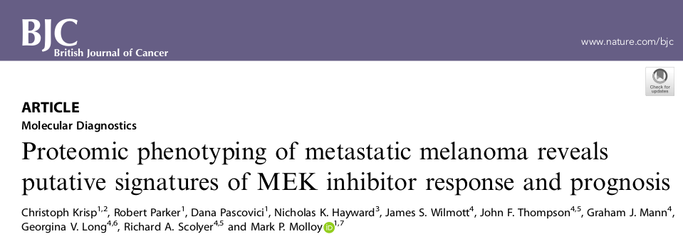

## Data Set Introduction

* 32 metastatic melanoma patients had their cancer analysed by SWATH mass spectrometry.

* 18 patients were categorised as *good* prognosis (survived more than four years) and 14 patients were categorised as *poor* prognosis (died less than two years).

.center[

]

* Protein abundance data is originally Supplementary Table S5b. [Link to paper.](https://www.nature.com/articles/s41416-018-0227-2)

---

## Formatted data

* RData file available in the [Github Repository](https://github.com/SydneyBioX/TrainClassifyR) in 'data' folder, [direct link to RData here](https://github.com/SydneyBioX/TrainClassifyR/blob/master/data/melanomaSWATH.RData).

--

```{r}
suppressMessages(library(ClassifyR))
load("data/melanomaSWATH.RData")
ls()
table(classes)
dim(measurements)
```
